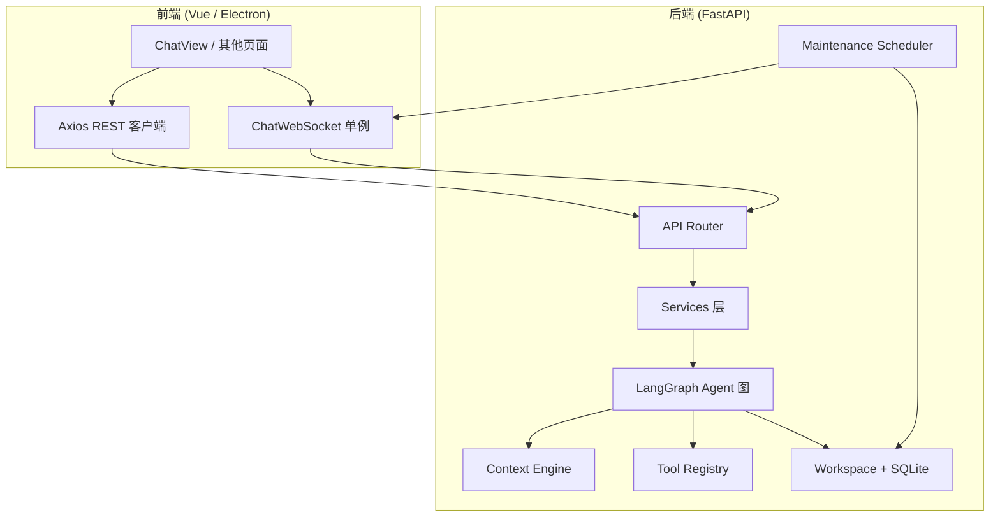

# 麦林 Mailin — 技术完整介绍

> 版本：0.1.0  
> 最后更新：2026-07-10

---

## 1. 项目概述

**麦林 Mailin** 是一款面向本地的 AI Agent 应用，采用前后端分离架构：后端负责 Agent 推理、工具执行与会话持久化，前端提供 Web 与 Electron 桌面双形态交互界面。

| 维度 | 说明 |
|------|------|
| 定位 | 本地优先的个人 AI 助手，支持多轮对话、工具调用、记忆沉淀与配置化管理 |
| 架构模式 | 前后端分离 + WebSocket/SSE 实时通信 |
| 部署形态 | Web 开发模式 / Electron 桌面安装包（Windows NSIS、macOS DMG、Linux AppImage） |
| 数据存储 | 本地文件系统工作区 + SQLite Checkpoint，无外部数据库依赖 |

```
┌─────────────────────────────────────────────────────────────────────┐
│                         麦林 Mailin 系统                             │
├──────────────────────────────┬──────────────────────────────────────┤
│         frontend/            │              backend/                 │
│  Vue 3 + Vite + Electron     │  FastAPI + LangGraph + LangChain     │
│  Ant Design Vue              │  SQLite Checkpoint + 本地工作区        │
├──────────────────────────────┴──────────────────────────────────────┤
│  通信：REST API · SSE 流式 · WebSocket（聊天 / 审批 / 后台推送）      │
└─────────────────────────────────────────────────────────────────────┘
```

---

## 2. 技术栈总览

### 2.1 后端

| 类别 | 技术 | 版本要求 |
|------|------|----------|
| 语言 | Python | ≥ 3.11 |
| Web 框架 | FastAPI + Uvicorn | ≥ 0.115 / ≥ 0.32 |
| Agent 框架 | LangGraph + LangChain Core | ≥ 1.0 / ≥ 0.3 |
| LLM 接入 | langchain-openai（OpenAI 兼容 API） | ≥ 0.3 |
| 状态持久化 | langgraph-checkpoint-sqlite | ≥ 2.0 |
| 数据校验 | Pydantic + pydantic-settings | ≥ 2.0 |
| 韧性 | tenacity（重试）+ pybreaker（熔断） | — |
| 日志 | structlog | ≥ 24.0 |
| 包管理 | uv | — |
| 可选：MCP | mcp | ≥ 1.0 |

### 2.2 前端

| 类别 | 技术 | 版本 |
|------|------|------|
| 框架 | Vue 3（Composition API） | ^3.5 |
| 构建 | Vite | ^7.3 |
| UI 库 | Ant Design Vue | ^4.2 |
| 路由 | Vue Router | ^5.0 |
| HTTP | Axios + 原生 fetch（SSE） | ^1.13 |
| 桌面壳 | Electron + electron-builder | ^35 / ^26 |
| Markdown | marked + DOMPurify | ^17 / ^3.3 |
| 语言 | TypeScript | ~5.9 |
| Node.js | — | ^20.19 或 ≥ 22.12 |

---

## 3. 仓库结构

```
mailin125/
├── .docs/                      # 项目文档（本文件所在目录）
├── .cursor/                    # Cursor Agent Skills 配置
├── backend/                    # Python 后端
│   ├── app/                    # 应用核心代码
│   │   ├── main.py             # FastAPI 入口与生命周期
│   │   ├── api/                # REST / WebSocket 路由
│   │   ├── agent/              # LangGraph ReAct 图
│   │   ├── context/            # 上下文引擎与记忆子系统
│   │   ├── tools/              # 工具注册与内置工具包
│   │   ├── services/           # 业务服务层
│   │   ├── storage/            # 工作区与 Checkpoint
│   │   ├── maintenance/        # 后台维护调度
│   │   ├── resilience/         # 超时 / 重试 / 熔断
│   │   ├── core/               # 设置、LLM、日志、遥测
│   │   └── schemas/            # Pydantic 请求/响应模型
│   ├── cli/                    # `mailin serve` CLI
│   ├── tests/                  # pytest 测试套件
│   ├── workspace/              # Agent 自有空间（人格、记忆、会话、技能）
│   ├── workspace_defaults/     # 只读模板（含 project/AGENTS.md 种子）
│   ├── langgraph.json          # LangGraph CLI 配置
│   ├── pyproject.toml
│   └── .env.example
└── frontend/                   # Vue + Electron 前端
    ├── src/
    │   ├── views/              # 页面视图（聊天 / 设置：配置与记忆）
    │   ├── api/                # HTTP / WS / SSE 客户端
    │   ├── components/         # 通用组件
    │   ├── composables/        # 组合式函数
    │   ├── router/             # 路由配置
    │   ├── theme/              # Ant Design 主题 Token
    │   └── utils/              # Markdown 渲染、工具展示格式化
    ├── electron/               # Electron 主进程与 preload
    ├── vite.config.ts
    └── package.json
```

---

## 4. 系统架构

### 4.1 整体数据流



### 4.2 后端启动生命周期

服务在 `app/main.py` 的 `lifespan` 中按序初始化：

1. 结构化日志（structlog）
2. 工作区初始化（从 `workspace_defaults/` 种子复制）
3. LangSmith 遥测（可选）
4. 韧性策略注册（LLM / 工具 / MCP / 图请求等）
5. Agent 钩子注册（如 shell 守卫）
6. SQLite Checkpointer 初始化
7. 预编译 LangGraph 图（`get_graph()`）
8. 后台维护调度器启动

关闭时逆序清理：停止调度器 → 关闭 MCP 连接 → 清除工具缓存 → 关闭 Checkpointer。

### 4.3 前端运行模式

| 模式 | 启动命令 | API 地址 | 路由模式 |
|------|----------|----------|----------|
| Web 开发 | `npm run dev:web` | Vite 代理 `/api` → `localhost:8000` | History 模式 |
| Electron 开发 | `npm run dev` | 直连 `http://127.0.0.1:8000` | Hash 模式 |
| Electron 生产 | `npm run electron:build` | 环境变量 `VITE_API_BASE_URL` | Hash 模式 + `base: './'` |

---

## 5. Agent 核心架构

### 5.1 LangGraph ReAct 循环

Agent 基于 LangGraph `StateGraph` 实现经典的 **ReAct（Reasoning + Acting）** 模式：

```
START → agent → [有 tool_calls?] → tools → agent → ... → END
                      ↓ 否
                     END
```

核心实现位于 `backend/app/agent/graph.py`：

- **agent 节点**：组装上下文 → 绑定工具 → 调用 LLM → 返回 AIMessage（可能含 tool_calls）
- **tools 节点**：执行工具调用（支持人工审批 interrupt）、批量运行、钩子 pre/post
- **should_continue 路由**：末条消息含 `tool_calls` 则进入 tools，否则结束

### 5.2 Agent 状态（AgentState）

| 字段 | 类型 | 说明 |
|------|------|------|
| `messages` | `list[BaseMessage]` | 会话账本，永不压缩，持久化到 Checkpoint |
| `step` / `max_steps` | `int` | 当前轮迭代步数 / 预算上限（默认 24） |
| `context_summary` | `str` | 历史压缩摘要 |
| `compression_count` | `int` | 已执行压缩次数 |
| `memory_turn_counter` | `int` | 记忆轮次计数 |
| `memory_nudge_pending` | `bool` | 是否待注入记忆整理提示 |
| `context_usage` | `dict` | 上下文 Token 用量统计 |
| `api_usage` | `dict` | API 真实 Token 用量 |
| `session_token_stats` | `dict` | 会话级累计统计 |
| `working_messages` | `list` | 运行时组装的上下文窗口（不写 Checkpoint） |

### 5.3 会话持久化

- 每个会话对应 LangGraph `thread_id`（即 `session_id`）
- Checkpoint 存储于 `workspace/sessions/checkpoints.sqlite`
- 优先使用 `AsyncSqliteSaver`，失败时回退 `MemorySaver`
- 删除会话时同步清理对应 thread 的 Checkpoint 数据

### 5.4 流式事件模型

Agent 执行过程通过统一事件模型推送给前端：

| 事件类型 | 说明 |
|----------|------|
| `token` | LLM 流式文本片段 |
| `tool_call` | 工具调用开始（含参数） |
| `tool_result` | 工具执行结果 |
| `context_usage` | 上下文 Token 用量更新 |
| `interrupt` | 工具审批中断（需用户 allow/deny） |
| `done` | 本轮对话完成 |
| `error` | 错误信息 |
| `background` | 后台维护任务状态 |
| `config_updated` | 配置热更新通知 |

推送通道：WebSocket（主路径）或 SSE（降级）。

---

## 6. 上下文引擎

上下文引擎（`backend/app/context/`）负责在 Token 预算内组装最优的 LLM 输入，并在超限时自动压缩。

### 6.1 上下文窗口结构

```
┌─────────────────────────────────────────┐
│  头部：Bootstrap + Skills + Memory Hints │
│         + Tools Disclosure              │
├─────────────────────────────────────────┤
│  中间：历史消息（可能被压缩为摘要）        │
├─────────────────────────────────────────┤
│  尾部：最近 20k tokens 的完整轮次         │
└─────────────────────────────────────────┘
```

### 6.2 Token 预算分配

在 `CONFIG.json` 的 `context.budget` 中配置（默认 128k 上限）：

| 区块 | 默认比例 | 内容 |
|------|----------|------|
| bootstrap | 18% | 身份、人格、用户画像等引导文件 |
| skills | 4% | Agent 技能定义 |
| summary | 12% | 历史压缩摘要 |
| recent_turns | 28% | 最近对话轮次 |
| tool_results | 25% | 工具执行结果 |
| current_message | 5% | 当前用户消息 |
| reserved | 8% | 预留缓冲 |

压缩阈值：`compress_threshold_ratio = 0.75`（达到 75% 预算时触发）。

### 6.3 四层压缩策略

| 层级 | 名称 | 触发条件 | 行为 |
|------|------|----------|------|
| A | TAIL_TOOL_SUMMARY | 尾部超大工具结果 | 截断并生成摘要 |
| B | OLD_TOOL_ONELINE | 尾部窗口外旧工具结果 | 压缩为单行 |
| C | MIDDLE_SUMMARY | 混合信号 / 超预算 | LLM 分块摘要中间历史 |
| D | REJECT | 压缩次数耗尽 | 拒绝继续，返回错误 |
| EMERGENCY | emergency_compress | API 413 / 上下文超长 | 紧急压缩重试 |

### 6.4 工具结果缓存

超大工具结果落盘到当前会话绑定项目下的 `.mailin/tool_results/`，上下文中仅保留引用，避免撑爆 Token 预算。建议将 `.mailin/` 加入项目 `.gitignore`。

---

## 7. 记忆系统

Mailin 采用**三层记忆架构**：

```
热层 (Hot)          温层 (Warm)           冷层 (Cold)
memory/             memory/               bootstraps/
YYYY-MM-DD.md  →    当日笔记追加     →    MEMORY.md
(每日工作记忆)      (sediment)            (长期记忆)
```

### 7.1 热层 — 每日工作记忆

- 路径：`workspace/memory/YYYY-MM-DD.md`
- 工具：`memory_list`、`memory_get`、`memory_grep`、`memory_add`
- 用途：记录当天的工作笔记、临时上下文

### 7.2 沉淀流程（Consolidation）

后台维护任务（每 5 分钟）自动执行：

1. **候选提取** — 从热层笔记中提取值得长期保留的信息
2. **Rule Router** — 基于规则将候选路由到 `MEMORY.md` 的对应 section
3. **LLM 仲裁** — 冲突合并与质量判断
4. **状态机合并** — 写入 `bootstraps/MEMORY.md` 长期记忆

手动触发：`memory_consolidate` 工具。

### 7.3 Bootstrap 引导文件

位于 Agent 自有空间 `workspace/bootstraps/`，定义人格与长期记忆。项目规则改为工作区根目录的 `AGENTS.md`。

| 文件 | 用途 |
|------|------|
| `SOUL.md` | 产品身份、人格与语气 |
| `USER.md` | 用户画像与偏好 |
| `MEMORY.md` | 长期记忆（冷层） |
| `HEARTBEAT.md` | 周期性自检行为 |
| `memory_sections.json` | 记忆分区定义 |
| `user_sections.json` | 用户画像分区定义 |

---

## 8. 工具系统

### 8.1 工具注册与加载

`backend/app/tools/registry.py` 中的 `ToolRegistry` 按 `CONFIG.json` 的 `tools.*` 开关动态加载工具包，结果经 LRU 缓存。

### 8.2 内置工具包

| 包名 | config_key | 工具 | 说明 |
|------|------------|------|------|
| filesystem | `filesystem` | read/write/replace/list/search/glob/mkdir/move/delete | 工作区沙箱内文件操作；read 带行号，search 为正则 |
| shell | `shell` | `run_shell`、`process` | 命令行执行（可后台）与本会话作业 list/wait/kill |
| session | `session` | `todo`、`ask_user` | 会话待办（status enum）与向用户提问 |
| memory | `memory` | list/get/grep/add/consolidate | 记忆读写与沉淀（默认冷） |
| calculator | `calculator` | `python_calculator` | AST 安全 Python 求值（默认冷） |
| datetime | `datetime` | `get_current_time` | 当前时间（IANA 时区，默认冷） |
| web | `web_search` | `web_search` | Tavily 搜索（未配置时回退 DuckDuckGo，默认冷） |
| mcp | `mcp` | 动态 MCP 工具 + `mcp_status` | 外部 MCP 服务器集成（默认冷） |

### 8.3 Shell 工具安全机制

- `safety_mode`：启用命令守卫
- `auto_approve_patterns`：白名单命令免审批（如 `git status`、`ls`）
- 高风险命令触发 **interrupt**（`kind: approval`），前端弹出审批 Modal
- `ask_user` 走同一通道但 `kind: ask_user`，前端为选项或短答
- 进程登记表按会话隔离作业 id，支持取消与 `process` 工具

### 8.4 渐进式工具披露（Tool Search）

当工具数量较多时，通过 BM25 检索实现按需加载：

| 阶段 | 工具 | 说明 |
|------|------|------|
| 热工具 | 直接 `bind_tools` | 默认内核九件套 + `list_directory` |
| 冷工具 | `tool_search` → `tool_describe` → `tool_call` | memory / calculator / datetime / web / MCP |

配置位于 `CONFIG.json` 的 `tools.tool_search` 节。

### 8.5 MCP 集成

- 在 `CONFIG.json` 的 `mcp_servers` 中配置外部 MCP 服务器
- 连接管理：`backend/app/tools/mcp/lifecycle.py`
- 健康检查：后台每 10 分钟探测，状态变化通过 WebSocket 推送
- 可选依赖：`uv sync --extra mcp`

---

## 9. API 参考

### 9.1 REST 端点

**基础地址**：`http://localhost:8000`

#### 健康检查

| 方法 | 路径 | 响应 |
|------|------|------|
| GET | `/health` | `{ "status": "ok", "has_llm": bool }` |

#### 聊天（Chat）

| 方法 | 路径 | 说明 |
|------|------|------|
| POST | `/api/chat/send` | 同步对话（排障 / 强类型 ChatResponse） |
| POST | `/api/chat/send/stream` | SSE 流式对话（WebSocket 失败时降级） |

#### 会话（Session）

| 方法 | 路径 | 说明 |
|------|------|------|
| GET | `/api/session/list` | 列出所有会话（含 title、workspace_path） |
| POST | `/api/session/create` | 创建新会话（需绑定项目文件夹） |
| GET | `/api/session/{id}` | 获取会话元数据 |
| POST | `/api/session/{id}/workspace` | 更换会话绑定的项目文件夹 |
| PATCH | `/api/session/{id}/title` | 重命名会话标题 |
| DELETE | `/api/session/{id}` | 删除会话及 Checkpoint |
| GET | `/api/session/{id}/history` | 消息历史 + Token 统计 |

#### 记忆（Memory）

| 方法 | 路径 | 说明 |
|------|------|------|
| GET | `/api/memory/list` | 列出每日记忆文件 |
| GET | `/api/memory/{filename}` | 读取指定记忆内容 |

#### 配置（Config）

| 方法 | 路径 | 说明 |
|------|------|------|
| GET | `/api/config/list` | 可编辑配置项列表 |
| GET | `/api/config/agent/info` | Agent 名称等元信息 |
| GET | `/api/config/{name}` | 读取配置（CONFIG / bootstraps） |
| PUT | `/api/config/{name}` | 更新配置（清缓存 + WS 广播） |
| POST | `/api/config/reset` | 重置（可选 reset_sessions / reset_memory / reset_global_config） |

### 9.2 WebSocket 协议

**连接地址**：`ws://localhost:8000/api/ws/chat`

#### 客户端消息（op 字段）

| op | 参数 | 说明 |
|----|------|------|
| `ping` | — | 心跳，返回 `pong` |
| `session.subscribe` | `session_id` | 订阅会话级事件 |
| `chat.send` | `message`, `session_id`, `run_id` | 发起对话 |
| `chat.cancel` | `run_id` | 取消进行中的 run |
| `approve` | `run_id`, `decision`（`allow` / `deny`） | 工具审批 |

#### 服务端推送

推送 `AgentEvent` JSON，含 `type` 字段（见 §5.4 流式事件模型）。

### 9.3 请求追踪

所有 HTTP 请求支持 `X-Trace-Id` 头；未提供时服务端自动生成并在响应头中返回。

---

## 10. 前端架构

### 10.1 页面与路由

| 路由 | 页面 | 功能 |
|------|------|------|
| `/` | ChatView | 主聊天界面：流式对话、工具展示、审批、Token 统计 |
| `/settings` | SettingsView | 设置壳：页签进入配置 / 记忆（全局，Agent 自有空间） |
| `/settings/config` | ConfigView | Agent 配置编辑与重置 |
| `/settings/memory` | MemoryView | 每日工作记忆浏览 |
| `/sessions` | 重定向到 `/` | 兼容旧会话页地址 |
| `/config`、`/memory` | 重定向到设置页签 | 兼容旧主导航地址 |

左侧栏是项目工作区导航：按绑定文件夹分组，组内为该项目的会话列表；底部齿轮进入设置。记忆与配置不再作为与聊天平级的主导航项。

### 10.2 实时通信策略

```
用户发送消息
    │
    ▼
sendMessageWs() ──成功──▶ WebSocket 流式接收
    │
    失败
    ▼
sendMessageStream() ──▶ SSE 降级
```

`ChatWebSocket`（`src/api/ws.ts`）为全局单例，承载：

- 聊天流式事件
- 工具审批 interrupt
- 后台维护通知（`background` 事件）
- 配置热更新（`config_updated` 事件）

特性：30s 心跳、指数退避重连（1s–30s）、按 `run_id` 管理回调。

### 10.3 ChatView 核心能力

- 虚拟滚动窗口（`RENDER_WINDOW = 30`）优化长对话性能
- 工具调用卡片展示（友好名称、参数格式化、结果预览）
- 上下文 / API Token 用量实时统计
- 工具审批 Modal（allow / deny）
- `localStorage` 持久化 `mailin.lastSessionId`

### 10.4 Electron 集成

| 组件 | 文件 | 说明 |
|------|------|------|
| 主进程 | `electron/main.cjs` | 1280×800 无边框窗口、IPC 窗口控制 |
| Preload | `electron/preload.cjs` | `window.mailin` API（minimize / maximize / close） |
| 标题栏 | `components/TitleBar.vue` | 自定义红黄绿按钮 + Logo |

### 10.5 设计系统

主题定义于 `src/theme/mailin.ts`：

| Token | 值 | 用途 |
|-------|-----|------|
| 主色 | `#C4A035`（麦穗金） | 按钮、强调 |
| 背景 | `#F7F4ED`（暖色） | 页面底色 |
| 辅色 | 森林绿 | 侧边栏渐变 |
| 圆角 | 8px | 全局组件 |

---

## 11. 韧性设计

`backend/app/resilience/` 为所有外部依赖调用提供统一韧性包装：

| 策略 | 超时 | 重试 | 熔断阈值 |
|------|------|------|----------|
| LLM | 60s | 2 次 | 8 次失败 → 开路 45s |
| 工具 | 15s | — | 10 次失败 → 开路 30s |
| MCP | 25–45s | — | — |
| 上下文步骤 | 10s | — | — |
| 图请求 | 300s | — | — |
| 工具批处理 | 45s | — | — |

实现：`tenacity` 重试 + `pybreaker` 熔断 + `asyncio` 线程池超时。

---

## 12. 后台维护

`backend/app/maintenance/` 调度器在服务启动后自动运行（30s tick）：

| 任务 | 间隔 | 说明 |
|------|------|------|
| 记忆沉淀 | 300s（5 分钟） | 热层 → 长期记忆自动 consolidate |
| MCP 健康检查 | 600s（10 分钟） | 探测 MCP 连接状态 |
| 记忆整理 Nudge | 按需 | 会话级注入记忆整理提示 |

维护结果通过 WebSocket `background` 事件推送给前端 `MaintenanceNotifier` 组件。

---

## 13. 配置与环境变量

### 13.1 后端环境变量（`.env`）

| 变量 | 必填 | 说明 |
|------|------|------|
| `OPENAI_API_KEY` | 二选一 | OpenAI 或兼容 API 密钥 |
| `OPENAI_BASE_URL` | 否 | 兼容 API 地址 |
| `DASHSCOPE_API_KEY` | 二选一 | 阿里云 DashScope 密钥 |
| `DASHSCOPE_BASE_URL` | 否 | 默认 `https://dashscope.aliyuncs.com/compatible-mode/v1` |
| `TAVILY_API_KEY` | 否 | Tavily 搜索（未设置回退 DuckDuckGo） |
| `HOST` / `PORT` | 否 | 默认 `0.0.0.0:8000` |
| `LANGCHAIN_TRACING_V2` | 否 | 启用 LangSmith 追踪 |
| `LANGCHAIN_API_KEY` | 否 | LangSmith API 密钥 |
| `LANGCHAIN_PROJECT` | 否 | 默认 `mailin` |
| `LOG_LEVEL` | 否 | 默认 `INFO` |
| `LOG_FORMAT` | 否 | `console` 或 `json` |

### 13.2 前端环境变量（`.env`）

| 变量 | 说明 |
|------|------|
| `VITE_API_BASE_URL` | REST API 基础地址（含 `/api`） |
| `VITE_API_BASE` | SSE 流式基础地址（不含 `/api`） |
| `VITE_ELECTRON` | Electron 构建标志 |

### 13.3 工作区配置（`CONFIG.json`）

运行时位于 `workspace/CONFIG.json`，关键字段：

```json
{
  "agent": {
    "model": "qwen-plus",
    "temperature": 0.7,
    "max_steps": 24
  },
  "tools": { /* 各工具包开关 */ },
  "mcp_servers": { /* MCP 服务器配置 */ },
  "context": {
    "max_tokens": 128000,
    "compress_threshold_ratio": 0.75,
    "budget": { /* Token 预算比例 */ }
  }
}
```

可通过前端配置页面或 API 在线修改，修改后自动清缓存并通过 WebSocket 广播。

---

## 14. 快速开始

### 14.1 后端

```bash
cd backend

# 安装依赖
uv sync

# 可选：MCP 支持
uv sync --extra mcp

# 配置 LLM
cp .env.example .env
# 编辑 .env，填入 API Key

# 启动服务
uv run mailin serve
# 或开发热重载
uv run mailin serve --reload
```

### 14.2 前端

```bash
cd frontend

# 安装依赖
npm install

# Web 开发模式
npm run dev:web

# Electron 桌面开发
npm run dev

# 构建桌面安装包
npm run electron:build
```

### 14.3 联调

```bash
# 终端 1：后端
cd backend && uv run mailin serve

# 终端 2：前端
cd frontend && npm run dev:web
```

前端 Vite 代理将 `/api` 和 WebSocket 转发到 `http://localhost:8000`。

### 14.4 LangGraph CLI 独立调试

```bash
cd backend
uv run langgraph dev
```

使用 `langgraph.json` 配置，可独立于 FastAPI 调试 Agent 图。

---

## 15. 测试与评估

### 15.1 单元测试

```bash
cd backend
uv run pytest
```

测试覆盖：上下文压缩、内容清洗、文件系统工具、Shell 守卫、MCP 集成、WebSocket 契约、韧性策略、记忆子句等 20+ 测试文件。

---

## 16. 安全考量

| 层面 | 措施 |
|------|------|
| 文件系统 | 工具操作限制在会话绑定的项目工作区内，禁止落入 Agent 自有空间 |
| Shell | 安全守卫 + 白名单免审批 + 高风险命令人工审批 |
| 计算器 | AST 白名单求值，禁止 import / exec |
| 前端渲染 | DOMPurify 消毒 Markdown 输出，防 XSS |
| Electron | `contextIsolation` + `sandbox`，preload 最小暴露 |
| API | 本地部署，无认证层（面向单机使用） |
| 密钥 | `.env` 不入库，通过环境变量注入 |

---

## 17. 可观测性

| 能力 | 配置 | 说明 |
|------|------|------|
| 结构化日志 | `LOG_FORMAT=json` | structlog，含 trace_id |
| 请求追踪 | `X-Trace-Id` 头 | 全链路 trace |
| LangSmith | `LANGCHAIN_TRACING_V2=true` | Agent 执行链路追踪 |
| Token 统计 | 前端 ChatView | 上下文 / API 用量实时展示 |
| 后台通知 | WebSocket `background` | 维护任务状态推送 |

---

## 18. 扩展指南

### 18.1 添加新工具包

1. 在 `backend/app/tools/packages/` 下创建新包目录
2. 继承 `ToolPackage` 基类，实现 `get_tools()` 和 `get_cards()`
3. 在 `packages/__init__.py` 中注册
4. 在 `CONFIG.json` 的 `tools` 节添加开关

### 18.2 添加 Agent 钩子

在 `backend/app/agent/hooks/` 中注册事件钩子（pre_tool / post_tool 等），参考 `builtins.py`。

### 18.3 添加前端页面

1. 在 `src/views/` 创建 Vue 组件
2. 在 `src/router/index.ts` 添加路由
3. 在 `App.vue` 侧边栏添加导航项

### 18.4 集成新 MCP 服务器

在 `workspace/CONFIG.json` 的 `mcp_servers` 中添加服务器配置：

```json
{
  "mcp_servers": {
    "my-server": {
      "transport": "stdio",
      "command": "npx",
      "args": ["-y", "@modelcontextprotocol/server-example"]
    }
  }
}
```

---

## 19. 已知限制与路线图

| 项目 | 现状 |
|------|------|
| 用户认证 | 无（本地单机场景） |
| 多用户 | 不支持 |
| 云同步 | 不支持，数据纯本地 |
| 多 Agent 协作 | 引导文件已预留（AGENTS.md），运行时未实现 |

---

## 20. 相关文档

| 文档 | 路径 |
|------|------|
| 后端 README | `backend/README.md` |
| Bootstrap 说明 | `backend/workspace_defaults/bootstraps/README.md` |
| MCP 工具目录 | `backend/app/tools/mcp/catalog/README.md` |
| 前端环境变量 | `frontend/.env.example` |
| 后端环境变量 | `backend/.env.example` |

---

*本文档基于项目源码自动生成，如有出入请以实际代码为准。*
