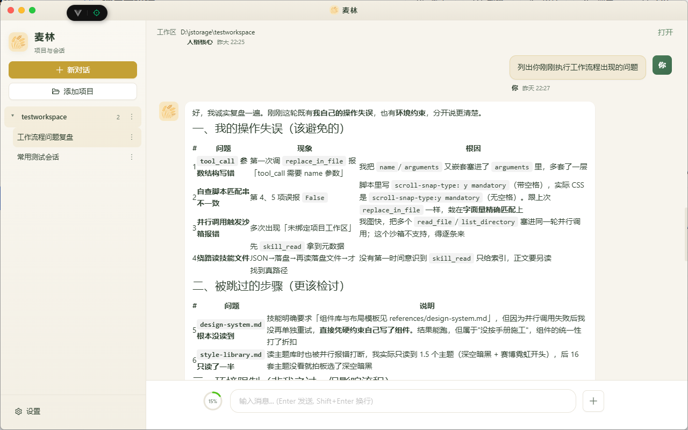
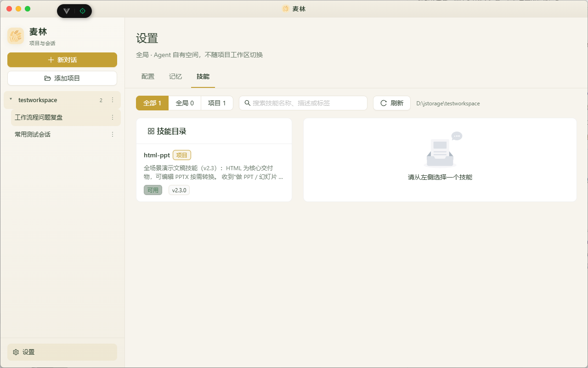

# 麦林 Mailin

本地优先的个人 AI Agent 应用。麦林把多轮对话、项目文件操作、Shell 执行、记忆沉淀、MCP 工具和配置化管理放在一个桌面/网页界面里，目标是让个人开发与研究工作流更顺手、更可控。





## 适合做什么

- 面向一个本地项目目录，与 Agent 持续对话并让它读写文件、运行命令、整理上下文。
- 用 WebSocket 流式对话作为主路径，支持 SSE 降级、工具审批、取消、重连和后台事件。
- 通过本地工作区保存会话、记忆、配置和工具结果，不依赖外部数据库。
- 支持 MCP 外部工具、内置文件系统/Shell/记忆/搜索/计算/时间等工具。
- 为长历史和密集流式输出做了最近页优先、结果预览、分阶段状态和批量渲染优化。

## 技术栈

- 后端：Python、FastAPI、LangGraph、LangChain、SQLite checkpoint、Pydantic、uv。
- 前端：Vue 3、Vite、TypeScript、Ant Design Vue、Electron。
- 通信：REST API、WebSocket、SSE。

## 快速开始

### 1. 启动后端

```bash
cd backend
uv sync
cp .env.example .env
uv run mailin serve
```

`.env` 至少配置一个 OpenAI 兼容密钥：`OPENAI_API_KEY` 或 `DASHSCOPE_API_KEY`。

### 2. 启动前端

```bash
cd frontend
npm install
npm run dev:web
```

桌面开发模式：

```bash
npm run dev
```

默认后端地址为 `http://localhost:8000`，前端开发服务会代理 `/api` 和 WebSocket。

## 仓库结构

```text
mailin125/
├── README.md
├── cover.png
├── settingPage.png
├── backend/      # FastAPI + LangGraph 后端
├── frontend/     # Vue + Electron 前端
└── openspec/     # 规格驱动变更记录
```

更多开发细节见：

- [后端 README](./backend/README.md)
- [前端 README](./frontend/README.md)

## 测试

```bash
cd backend
uv run pytest

cd ../frontend
npm run type-check
npm run perf:fixtures
```

## 项目状态

麦林仍处于早期开发阶段，接口、配置和内部实现可能继续调整。当前定位是本地单机场景，没有多用户认证、云同步或生产部署保证。
