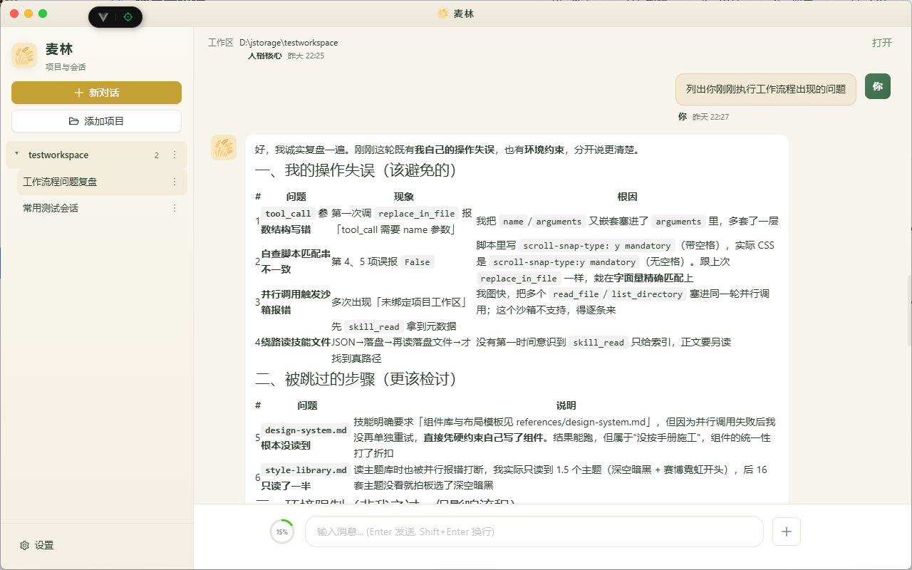
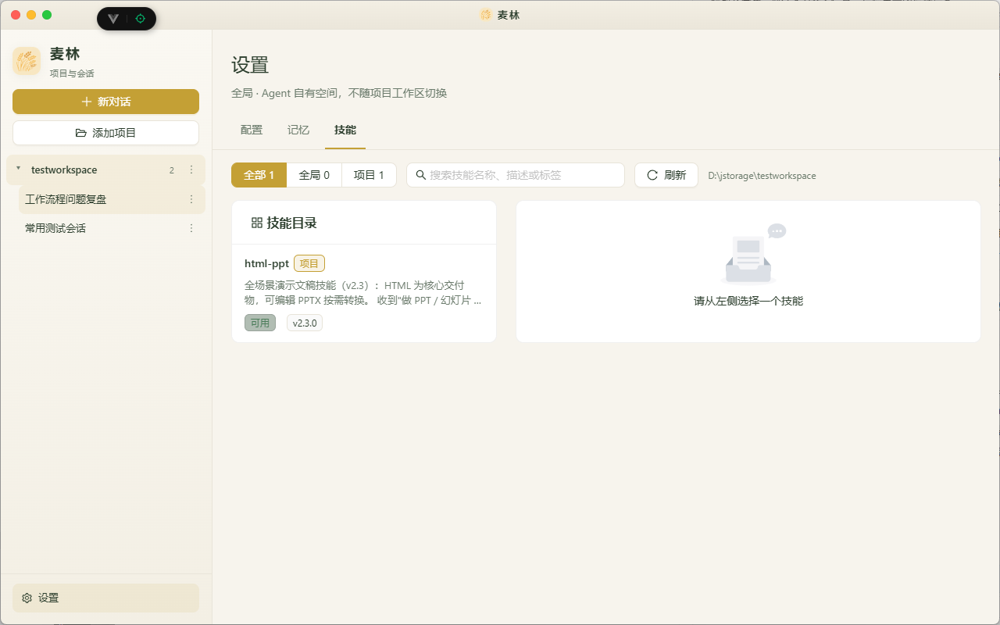

# 麦林 Mailin

本地优先的个人 AI Agent 应用。麦林把多轮对话、项目文件操作、Shell 执行、记忆沉淀、MCP 工具和配置化管理放在一个桌面/网页界面里，目标是让个人开发与研究工作流更顺手、更可控。





## 适合做什么

- 面向一个本地项目目录，与 Agent 持续对话并让它读写文件、运行命令、整理上下文。
- 用 WebSocket 流式对话作为主路径，支持 SSE 降级、工具审批、取消、重连和后台事件。
- 通过本地运行根保存会话、记忆和工具结果；全局配置落在 `.runtime/data/config/config.toml`，不依赖外部数据库。
- 支持 MCP 外部工具、内置文件系统/Shell/记忆/搜索/计算/时间等工具。
- 为长历史和密集流式输出做了最近页优先、结果预览、分阶段状态和批量渲染优化。

## 技术栈

- 后端：Python、FastAPI、LangGraph、LangChain、SQLite checkpoint、Pydantic、uv。
- 前端：Vue 3、Vite、TypeScript、Ant Design Vue、Electron。
- 通信：REST API、WebSocket、SSE。

## 快速开始

### 1. 启动后端

```bash
cd backend
uv sync
cp .env.example .env
uv run mailin serve
```

`.env` 至少配置一个 OpenAI 兼容密钥：`OPENAI_API_KEY` 或 `DASHSCOPE_API_KEY`。

### 2. 启动前端

```bash
cd frontend
npm install
npm run dev:web
```

桌面开发模式：

```bash
npm run dev
```

默认后端地址为 `http://localhost:8000`，前端开发服务会代理 `/api` 和 WebSocket。

### 开发数据与发布资源

开发时，默认模板仍在仓库内维护：

```text
backend/resources/defaults/workspace/  # Agent / 项目模板，只读
backend/resources/defaults/config/     # config.toml 默认值，只读
.runtime/data/                         # 配置、Agent home、会话、记忆、checkpoint
.runtime/cache/                        # 可重建缓存
.runtime/tmp/                          # 临时文件
.runtime/log/                          # 日志
```

发布时，Electron 安装包只包含程序和只读资源。安装器允许选择安装目录；首次启动时选择运行根。运行根自动派生 `data/cache/tmp/log`，设置页显示这些路径。安装目录和运行根可独立设置，升级安装包不会覆盖用户数据。

后端也支持显式运行路径：

```bash
uv run mailin serve --mode development --runtime-root D:\\MailinDevRuntime
uv run mailin serve --mode production --host 127.0.0.1 --port 0 --runtime-root D:\\MailinRuntime --resources-dir <resources-dir>
```

## 仓库结构

```text
mailin125/
├── README.md
├── cover.png
├── settingPage.png
├── backend/      # FastAPI + LangGraph 后端
├── frontend/     # Vue + Electron 前端
└── openspec/     # 规格驱动变更记录
```

更多开发细节见：

- [后端 README](./backend/README.md)
- [前端 README](./frontend/README.md)

## 测试

```bash
cd backend
uv run pytest

cd ../frontend
npm run type-check
npm run perf:fixtures
```

## 从旧布局升级

开发启动会检测仓库根下的 `.devdata/.devcache/.devtemp/.devlogs`，先复制到新的 `.runtime/data/cache/tmp/log` 并逐文件校验，再转换旧配置。若旧 `backend/app/config/CONFIG.json` 与 `.devdata/config/CONFIG.json` 同时存在，以前者为当前配置；后者保存在 `.runtime/data/config/legacy-alternate.toml.bak`。完成标记写入后清理旧目录。此清理不可逆；需要保留历史快照时，请在启动前自行备份旧目录。

迁移遇到配置无效、目标不为空、复制或校验失败时会停止启动并保留源数据。先检查报错路径，再清理冲突目标或选择空的运行根。发布版由 Electron 在启动托管后端前调用同一迁移器；也可使用 `mailin migrate --runtime-root <新运行根> --resources-dir <资源根> --legacy-data-root <旧数据目录>` 手动迁移。迁移后普通运行只读取 `data/config/config.toml`。诊断入口在「设定」页，可查看两个根路径、四个派生目录、后端错误并打开日志目录。

## 项目状态

麦林仍处于早期开发阶段，接口、配置和内部实现可能继续调整。当前定位是本地单机场景，没有多用户认证、云同步或生产部署保证。
